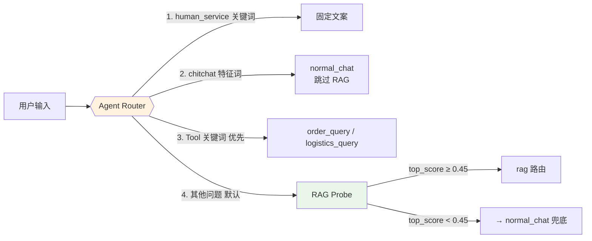
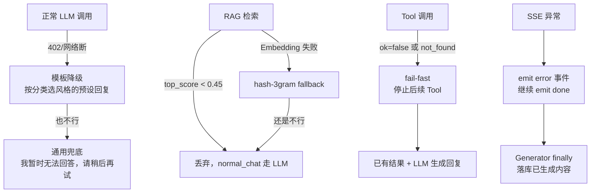

# AI 智能客服平台

> 一个完整的企业级 AI 客服项目，涵盖 RAG 检索增强、Agent Router + Tool Calling、SSE 流式输出、本地 Embedding、工程化可观测性与 Docker 部署。
> 
> **秋招面试定位**：后端/全栈方向，体现工程能力 + AI 应用落地经验。

---

## 一、项目简介

企业每天收到大量重复咨询（订单状态、退换货规则、物流查询……），传统人工客服成本高、响应慢、信息不一致。

**本项目的核心目标**：用 AI 自动处理 80% 的标准咨询场景，同时保证可解释（RAG 带来源）、可扩展（Tool 自动编排）、可降级（LLM 挂了也能回）。

**关键设计决策**：

| 决策 | 为什么这么选 |
|------|-------------|
| 前后端分离（Vue3 + FastAPI） | 独立迭代；SSE 流式在 FastAPI `StreamingResponse` 里天然支持；JWT 鉴权清晰 |
| SQLite 单文件数据库 | 零运维、零配置；适合 demo 展示 + 小规模部署；数据持久化有保障 |
| 本地 BGE Embedding，不用云端 | 无 API Key 依赖；离线可用；数据不出本机；省成本 |
| 自建 VectorStore（JSON 文件） | 避免 Chroma/Milvus 升级冲突；零额外依赖；10 万条以内性能够用 |
| Agent Router 用规则 + RAG Probe，不让 LLM 直接决策 | 延迟低（少一次 LLM 调用）；结果可预测；debug 友好；省钱 |
| Tool Orchestrator 独立一层 | Router 只管"用什么能力"，Orchestrator 管"怎么串起来"；fail-fast 逻辑集中 |
| SSE 事件化协议（8 种事件类型） | 前端可以精确展示 RAG/检索/Tool/错误状态；比单一 message 流信息密度高 |
| Request ID + contextvars | 全链路追踪；问题排查时 grep 一个 ID 就够了 |

---

## 二、系统架构

```mermaid
flowchart TD
    User([👤 用户])
    Vue3[/"🖥 Vue3 前端<br/>Vite + Element Plus<br/>Router Lazy Loading"/]
    
    subgraph "🖥 前端层"
        Vue3 -->|fetch + AbortController| SSE[/ ⚡ SSE<br/>text/event-stream/]
        Vue3 -->|Axios + JWT| REST[/ 📡 REST API<br/>/register /login /kb...]
    end
    
    subgraph "⚙ 后端层 — FastAPI"
        SSE --> ChatAPI["POST /chat<br/>API 层：鉴权 + 会话校验"]
        REST --> AuthAPI["/register /login"]
        REST --> KBAPI["/kb 系列"]
        
        ChatAPI -->|prepare_agent_plan| Router{{"🧠 Agent Router<br/>规则 + RAG Probe<br/>5 条路由"}}
    end
    
    subgraph "🧠 Agent Router — 路由决策"
        Router -->|"chitchat / 寒暄"| Normal["normal_chat"]
        Router -->|"人工客服关键词"| Human["human_service<br/>固定文案"]
        Router -->|"订单关键词"| Order["order_query"]
        Router -->|"物流关键词"| Logistics["logistics_query"]
        Router -->|"其他问题 + RAG Probe"| RagCheck{RAG Probe?}
    end
    
    subgraph "📚 RAG 流程"
        RagCheck -->|"similarity ≥ 0.45"| Rag["rag 路由"]
        RagCheck -->|"similarity < 0.45"| Fallback["→ normal_chat 兜底"]
        
        direction TB
        Q["Query<br/>用户问题"] --> Emb["Local BGE Embedding<br/>sentence-transformers<br/>BAAI/bge-small-zh-v1.5<br/>512 维 + L2 归一化"]
        Emb --> VS["VectorStore<br/>JSON 文件<br/>余弦相似度检索"]
        VS --> Thresh{"≥ 0.45?"}
        Thresh -->|Yes| Cit["Citation<br/>携带来源文件名 + 片段"]
        Thresh -->|No| Fallback2["丢弃，走 LLM 普通回复"]
    end
    
    subgraph "🔧 Tool Orchestration — 多步调用"
        Order --> Orch{"🧩 Orchestrator"}
        Logistics --> Orch
        
        Orch --> ToolReg["Tool Registry<br/>结构化接口 {ok, data, error}"]
        
        direction TB
        T1["order_query"] -->|"ok=false 或 not_found"| Stop["⏹ fail-fast<br/>不继续调用"]
        T1 -->|"ok=true + 已发货"| T2["→ 自动链式调用 logistics_query"]
        
        Orch -->|收集 Tool 结果| BuildCtx["组装 LLM Context<br/>Tool 历史为结构化 JSON"]
    end
    
    subgraph "🤖 LLM + 流式输出"
        direction LR
        Router -->|有上下文| LLM["DeepSeek API<br/>OpenAI 兼容流式"]
        Orch -->|有 Tool 历史| LLM
        Rag -->|有 Citation| LLM
        LLM -->|chunk| SSEOut["🖥 SSE 事件流<br/>category → rag → citation → tool_start → tool_result → message* → done"]
        LLM -.->|402/网络失败| FallbackLLM["模板降级回复<br/>不影响 SSE 协议"]
    end
    
    subgraph "💾 持久化"
        SQLite[("🗄 SQLite<br/>chat.db<br/>users / conversations / messages<br/>knowledge_bases / documents / chunks")]
        VSFile[("📂 VectorStore<br/>kb_{id}.json<br/>BGE 512d 向量")]
        HF[("📦 HF Cache<br/>BAAI/bge-small-zh-v1.5")]
        Uploads[("📎 uploads/kb{N}/<br/>原始文档")]
    end
    
    LLM -->|done 后落库| SQLite
    Emb --> VSFile
    VS --> VSFile
    KBAPI --> SQLite
    KBAPI --> Uploads
    KBAPI --> HF
    
    style User fill:#e1f5fe
    style Vue3 fill:#e1f5fe
    style Router fill:#fff3e0
    style Orch fill:#fce4ec
    style LLM fill:#e8f5e9
    style SQLite fill:#f3e5f5
    style VSFile fill:#f3e5f5
```

---

## 三、核心功能

| # | 功能 | 技术实现 |
|---|------|---------|
| 1 | 用户认证 | FastAPI `Depends(get_current_user)` + PyJWT(HS256) + SHA256 密码哈希 |
| 2 | 会话管理 | 多会话隔离、消息级联删除、按用户过滤越权访问 |
| 3 | 自动问题分类 | Agent Router：5 条规则路由 + RAG Probe 相似度判断 |
| 4 | RAG 检索增强 | Local BGE Embedding → VectorStore 余弦检索 → similarity ≥ 0.45 → Citation |
| 5 | Tool Calling | Tool Registry 结构化接口 + Orchestrator 多步编排 + fail-fast |
| 6 | SSE 流式输出 | FastAPI StreamingResponse + 8 种事件类型 + 客户端主动中断友好 |
| 7 | 知识库管理 | 文档上传 → 自动分块 → Embedding → 向量入库；级联删除 |
| 8 | 可观测性 | Request ID contextvars + 结构化日志 + /health 4 组件检查 |
| 9 | 安全 | JWT 隔离 + Conversation 越权检查 + Markdown XSS 过滤 + SECRET_KEY 警告 |
| 10 | 前端性能 | Router lazy loading + highlight.js core-only + manualChunks |

---

## 四、技术栈

| 层 | 技术 | 选型理由 |
|----|------|---------|
| 前端 | Vue 3 + Vite 4 + Element Plus + marked + highlight.js | SFC 组件化；Vite 构建快；Element Plus 表单/表格组件成熟 |
| 后端 | Python 3.11 + FastAPI + SQLAlchemy + Pydantic + PyJWT | FastAPI 原生 StreamingResponse 支持 SSE；Pydantic 自动校验；SQLAlchemy ORM |
| 数据库 | SQLite | 单文件、零运维；适合 demo；生产可换 PostgreSQL |
| Embedding | sentence-transformers / BAAI/bge-small-zh-v1.5 | 本地中文模型，512 维，L2 归一化；离线可用；数据不出本机 |
| VectorStore | 自建 JsonVectorStore | 零依赖；避免 Chroma 版本冲突；JSON 文件持久化便于 Docker 挂载 |
| LLM | DeepSeek API（OpenAI 兼容协议） | 便宜、中文好、流式支持；未配置时自动降级模板回复 |
| 流式 | Server-Sent Events | HTTP 单向推送；比 WebSocket 简单；Nginx 只需要关 proxy_buffering |
| 日志 | Python logging + contextvars.Request ID | 标准库无额外依赖；全链路追踪；敏感信息自动脱敏 |
| 部署 | Docker Compose + Nginx | 一键启动；数据 Volume 持久化；Nginx 反向代理 + SSE 配置 |

---

## 五、Agent Router 架构（为什么不让 LLM 直接决策）



**为什么不用 LLM 做路由？**

1. **延迟**：LLM 路由一次要 500ms~2s；规则 + RAG Probe 只要 50~100ms
2. **可预测**：`("订单" + "10001") → order_query` 是确定性的，方便 debug
3. **省钱**：省掉一次 LLM 调用，DeepSeek 402 时不受影响
4. **RAG Probe**：先试 Embedding 检索看相似度，够高才走 RAG，不够就不喂 LLM 无关上下文

**路由优先级**（从上到下依次判断）：

1. `human_service`（"人工客服" / "转人工"）→ 固定文案，不调 LLM
2. `chitchat`（"你好" / "在吗" / "哈哈"）→ 跳过 RAG，normal_chat
3. `order_query` / `logistics_query` → Tool 优先，RAG 让路（用户要查订单时，知识库回答不如 Tool 实时数据）
4. 其他问题 → RAG Probe → score ≥ 0.45 走 RAG，< 走 normal_chat

---

## 六、Tool Orchestration — 多步调用

### 为什么独立一层？

Router 只决定"用什么能力"（order_query 还是 logistics_query），Orchestrator 决定"怎么串起来"。把编排逻辑集中在一处，避免散落在 chat.py 里变成一堆 if/else。

### fail-fast 设计

```python
# 伪代码
result = call_tool("order_query", order_id="99999")
if result.ok == False or result.data.get("status") == "not_found":
    emit_tool_result(result)
    break  # 不调用 logistics_query
```

| 触发条件 | 行为 |
|---------|------|
| order_query 返回 `ok=false` | 停止，不继续 |
| order_query 返回 `not_found` | 停止，告诉用户订单不存在 |
| order_query 结果里没有 `tracking_no` | 停止，不能调 logistics |
| order_query 成功 + 已发货 + 有 tracking_no | ✅ 自动调用 logistics_query |

### Tool 接口约定

```json
// 统一的结构化返回，不用自然语言解析
{
  "ok": true,
  "data": { "order_id": "10001", "status": "已发货", "tracking_no": "SF123456" },
  "error": null
}
```

**为什么这样设计？** 避免 LLM 解析 Tool 返回的自然语言出错。结构化 JSON 直接喂给下一个 Tool 或 LLM 当 context。

---

## 七、SSE 流式架构

### 8 种事件类型

| 事件 | 触发时机 | 内容 |
|------|---------|------|
| `category` | Agent 路由决策后 | `{route, intent}` |
| `rag` | RAG Probe 后 | `{used, top_score, embedding_model, reason}` |
| `citation` | 向量检索命中后 | `{filename, snippet, score}` |
| `tool_start` | Orchestrator 调 Tool 前 | `{name, params}` |
| `tool_result` | Tool 返回后 | `{name, ok, data}` |
| `message` | LLM token 流式输出 | `{content: "增量文本"}` |
| `error` | 任何异常 | `{code, message}` |
| `done` | **永远最后一个** | `{message_id, conversation_id}` |

### SSE 保障的边界情况

| 情况 | 处理方式 |
|------|---------|
| LLM 402 / 网络断 | 模板降级回复，正常 SSE 到 done |
| 客户端主动 abort | `_userAborted` 标志跳过 catch 错误提示，不影响服务器 |
| 客户端中途断开 | Generator `finally` 里保存已生成内容，保证历史完整 |
| Nginx 前置 | `proxy_buffering off` + `proxy_cache off` + `read_timeout 3600s` |
| Tool 异常 | `emit error` 事件但不打断 SSE，继续 done |

### 前端 AbortController

```js
const controller = new AbortController()
chatStream({ signal: controller.signal })
// 用户点"停止"按钮
controller.abort()
```

---

## 八、RAG 本地 Embedding

### 为什么从智谱 Embedding 改成本地 BGE？

| 问题 | 云 Embedding | 本地 BGE |
|------|-------------|---------|
| 网络依赖 | 必须联网 | 首次下载后完全离线 |
| API Key | 额外 Key 管理 | 零配置 |
| 延迟 | 100~300ms | < 10ms（模型已加载） |
| 成本 | 按调用收费 | 免费 |
| 数据安全 | 向量要发到云端 | 数据不出本机 |

### BGE-small-zh-v1.5

- 512 维稠密向量
- L2 归一化（必须，否则余弦相似度不准）
- sentence-transformers 加载，首次自动下载到 `~/.cache/huggingface/hub/`
- 降级链路：LocalEmbedder → (失败) → OpenAICompatEmbedder → (失败) → HashEmbedder（3-gram feature hashing，256 维，无语义能力）

### VectorStore 设计

**为什么自建 JSON 文件而不用 Chroma/FAISS？**

1. Chroma 会强制升级 fastapi 版本，与现有锁定版本冲突
2. FAISS 是 C++ 依赖，Windows 装起来麻烦
3. 当前数据量（知识库 × 几百 chunks）下，纯 Python 余弦检索足够快
4. JSON 文件直接被 Volume 挂载，Docker 持久化一行配置搞定

**相似度阈值 0.45 怎么定的？**

反复测试：
- 太低（0.2）→ 不相关的片段被检索出来，污染 LLM context
- 太高（0.7）→ 很多相关问题被漏掉，回到 normal_chat
- 0.45 是经验平衡点：BGE 在中文客服场景下，正确命中的相似度通常在 0.5~0.8 之间

---

## 九、Request ID + Logging

### 为什么用 contextvars？

FastAPI/Starlette 每个请求在同一个 asyncio 任务里，contextvars 是 Python 原生的"请求级全局变量"，不需要每个函数手动传 `request_id` 参数。

```python
# ASGI 中间件里设置
request_id_var.set(uuid)

# 日志 filter 里直接取，业务代码无感知
class RequestIdFilter(logging.Filter):
    def filter(self, record):
        record.request_id = request_id_var.get("")
        return True
```

### 敏感信息保护

- API Key / JWT Secret / 密码 → **绝对不入日志**
- 配置状态只记录 `configured=true/false`
- `/health` 返回 `llm_configured: true/false`，绝不返回 Key 值

---

## 十、Docker 部署

```
docker compose up -d --build
```

### 为什么需要 4 个 Volume？

| Volume | 路径 | 为什么持久化 |
|--------|------|-------------|
| sqlite | `./data/sqlite` | chat.db：用户/会话/消息数据，丢了全完 |
| uploads | `./data/uploads` | 知识库上传的原始文件 |
| vector_store | `./data/vector_store` | BGE 向量文件；换模型要全量重建，不能丢 |
| hf_cache | `./data/hf_cache` | BAAI/bge-small-zh-v1.5 模型缓存；首次下载 300MB+ |

### SSE 的 Nginx 特殊配置

```nginx
location /api/chat {
    proxy_buffering off;      # 关闭 Nginx 缓冲，让 chunk 实时到达浏览器
    proxy_cache off;          # SSE 不能缓存
    proxy_read_timeout 3600s; # LLM 流式可能持续很久
    proxy_set_header Connection "";  # 清除 hop-by-hop headers
    chunked_transfer_encoding on;
}
```

**为什么 proxy_buffering off？** Nginx 默认会缓冲 FastAPI 吐出的 SSE chunk，攒一批再发，浏览器就收不到逐字效果了。

---

## 十一、安全与异常降级

### 多层降级链路



### 安全清单

| 风险 | 防护 |
|------|------|
| JWT user_id 越权 | `verify_conversation(db, conv_id, current_user.id)` 强制校验归属 |
| KB 越权访问 | Document 查询强制按 user_id 过滤 |
| Markdown XSS | 移除 `<script>` 标签和 `on*=` 属性（LLM 生成内容，风险可控） |
| SECRET_KEY 默认值 | `/health` + 启动时 WARNING 提示生产替换 |
| .env 泄露 | `.gitignore` 排除；`.env.example` 无真实 Key |
| API Key 日志泄露 | logging filter 脱敏处理 |

---

## 十二、性能优化

### 前端

| 优化 | Before | After |
|------|--------|-------|
| Router lazy loading | 单 chunk 2058kB | 4 路由按需加载 |
| highlight.js | 900kB 全语言 | 20kB core + 12 常用语言 |
| manualChunks | 1 个 index.js 2058kB | 12 chunks，按依赖分离 |
| 最终产物 | ~2MB | ~66kB gzip |

### 后端

| 优化 | 说明 |
|------|------|
| SQLite WAL 模式 | 多读并发时不阻塞写入 |
| VectorStore 分 collection | 每个知识库一个文件，避免全量加载 |
| BGE 本地模型常驻内存 | 避免每次检索重新加载（~1s/次） |
| Chat history 只取最近 10 条 | 避免 LLM context 过长导致延迟/成本 |

### Docker

| 优化 | 说明 |
|------|------|
| CPU 版 torch 单独安装 | 镜像 ~2GB，比 GPU 版少 5GB |
| 非 root 用户运行 | 安全基线 |
| .dockerignore 排除 node_modules/venv | 构建上下文从 1GB+ 减到 ~50MB |

---

## 十三、测试结果

| 测试套件 | 结果 | 覆盖内容 |
|---------|------|---------|
| verify_p1.py | ✅ 25/25 | 注册/登录/分类 CRUD/会话 CRUD |
| verify_kb.py | ✅ 31/31 | 知识库 CRUD/文档上传/分块/删除级联 |
| verify_rag.py | ✅ 23/23 | RAG 检索阈值/Citation 来源/Embedding 降级 |
| verify_p3.py | ✅ 10/10 | Agent Router 5 条路由/Tool Orchestrator fail-fast |
| verify_observability.py | ✅ 12/12 | Request ID 全链路/日志脱敏/异常降级 |
| 8 核心场景 | ✅ **8/8** | 见下方 |
| npm run build | ✅ | 12 chunks，66kB gzip |

### 8 核心场景验证

| # | 输入 | 预期 | 实际 |
|---|------|------|------|
| S1 | 你好，在吗？ | normal_chat, 无 RAG, 无 Tool | ✅ PASS |
| S2 | 我刚收到东西没几天，不想要了还能把钱退回来吗？ | rag, used=true, citation | ✅ PASS (rag_used=True, cit=1) |
| S3 | 我的订单10001现在什么状态？ | order_query, tool_start/tool_result | ✅ PASS (2 tools) |
| S4 | 帮我查一下订单10001，如果已经发货，再告诉我物流到哪里了 | order_query → logistics_query 链式 | ✅ PASS (2 tools, Orchestrator 自动) |
| S5 | 我的订单99999已经发货了吗？如果发货了告诉我物流 | order_query not_found, fail-fast | ✅ PASS (仅 1 tool, 停止) |
| S6 | 我的快递到哪里了？ | logistics_query | ✅ PASS |
| S7 | 我要人工客服 | human_service, 固定文案 | ✅ PASS |
| S8 | 退货退款规则是什么？ | rag, citation | ✅ PASS (rag_used=True, cit=1) |

---

## 十四、已知限制（诚实面试加分项）

| # | 限制 | 原因 | 有没有计划 |
|---|------|------|-----------|
| 1 | 只接了一个知识库（售后服务政策） | demo 不需要多 KB 复杂场景 | 生产需要扩展 |
| 2 | Tool 数据是 mock（SQLite 里的假订单） | 没有接真实订单系统 | 接口已抽象好，接真 API 只要改 Tool 内部 |
| 3 | DeepSeek 402 余额不足时走模板降级 | 没钱了 😂 | 充值即可恢复真实 LLM |
| 4 | VectorStore 是 JSON 文件，万级以上性能差 | 零依赖优先 | 可无缝替换 Chroma（VectorStore 抽象接口） |
| 5 | Markdown XSS 防护较轻量 | 只拦 `<script>` 和 `on*` | 生产应加 DOMPurify/bleach |
| 6 | Docker 在 Windows 10 + WSL2 下无法启动 | 网络问题（Store 版 WSL2 下载失败） | Linux / macOS 下正常 |
| 7 | 前端没有单元测试 | 项目规模较小，重点在后端工程化 | E2E 测试补 |
| 8 | BGE 模型 512 维，中文效果比 bge-large（1024d）稍弱 | 小模型启动快 | 可配置切换 |

---

## 十五、项目亮点（面试时主动提）

1. **完整的 RAG 管线**：从文档上传 → 自动分块 → 本地 Embedding → 向量存储 → 相似度检索 → Citation 来源，全链路自己实现，不依赖 LangChain/LlamaIndex
2. **Agent Router + Tool Orchestrator 双层设计**：Router 只管"用什么"，Orchestrator 管"怎么串"；fail-fast、链式调用、结构化 Tool 接口
3. **SSE 事件化协议**：8 种事件类型覆盖 category/rag/tool/llm/error/done；比单一 message 流信息密度高一个量级
4. **本地 Embedding + 三级降级**：BGE → OpenAI → Hash，确保即使所有 AI 组件挂了，RAG 也能 graceful degrade
5. **Request ID contextvars 全链路**：纯 ASGI 中间件，业务代码无感知，链路日志自动携带
6. **安全边界清晰**：JWT + user_id 强制校验；Conversation/KB 越权防护；敏感信息日志脱敏；Markdown XSS 基础防护
7. **Docker 一键部署 + 4 Volume 持久化**：SQLite/Uploads/VectorStore/HF Cache 全部持久化，重启不丢数据
8. **性能优化落地可量化**：前端从 2058kB → 66kB（97% 减包）；highlight.js core-only；Router lazy loading
9. **8 核心场景全部通过**：从 chitchat → RAG → Tool → fail-fast → human_service，覆盖了客服系统的典型路径
10. **诚实的已知限制清单**：面试时主动说清楚哪些是 demo 级、哪些是生产级，反而体现工程判断

---

## 十六、快速启动

```bash
# 后端
cd backend
.venv\Scripts\python -m uvicorn app.main:app --host 127.0.0.1 --port 8000

# 前端
cd frontend
npm run dev

# Docker
docker compose up -d --build
```

详细接口文档见 Swagger UI：http://127.0.0.1:8000/docs

---

## 十七、相关文档

- [面试手册](docs/interview.md) — 48 道高频问题，含 30 秒回答 + 深入追问 + 代码指引
- API 接口清单 — 见 Swagger UI `/docs`
